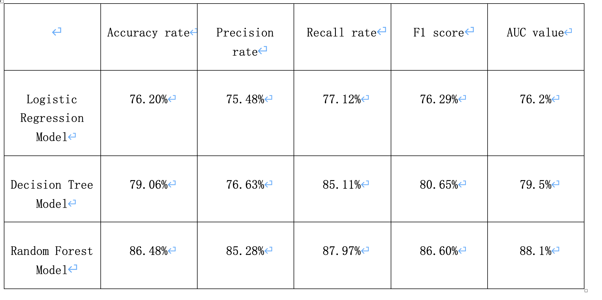
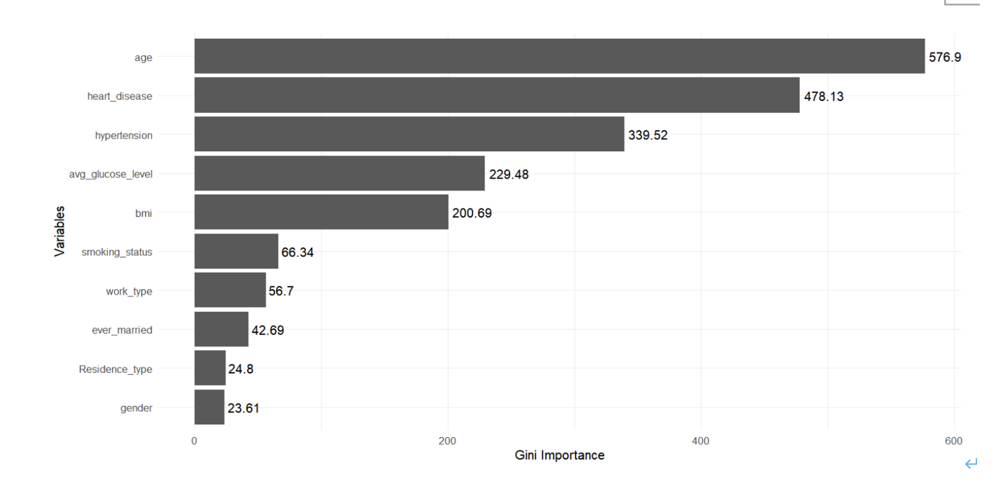
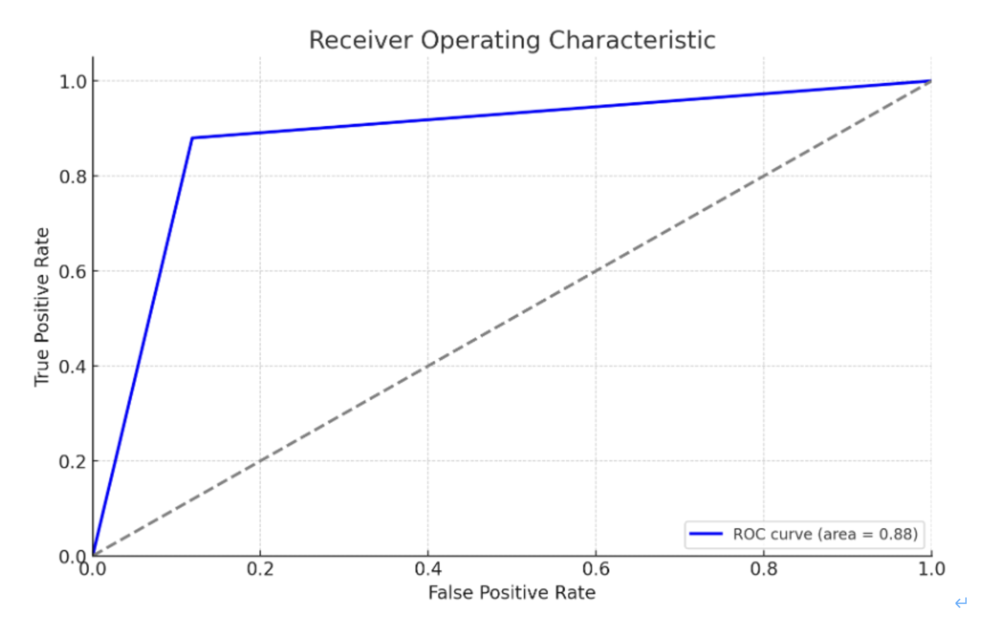

# Stroke Risk Prediction with Machine Learning (Thesis Portfolio)

## Overview
Portfolio summary of my undergraduate thesis on stroke risk prediction using machine learning models.

## Data
Public stroke dataset from Kaggle (n = 5,111). The outcome `stroke` is highly imbalanced (~4.9% positive class). The thesis applies ROSE resampling to address class imbalance.

## Methods
- Logistic Regression
- Decision Tree
- Random Forest
- Evaluation: Accuracy, Precision, Recall, F1-score, ROC/AUC

## Key Results
- Random Forest achieved the best overall performance (Accuracy 86.48%, F1 86.60%, AUC 0.881), outperforming Logistic Regression and Decision Tree.
- Random Forest feature importance highlights age as the dominant predictor, followed by heart disease and hypertension, consistent with clinical risk factors.

## Visual Highlights
**Model comparison**

**Random Forest feature importance**

**ROC curve (Random Forest)**

## Files
- Full thesis (Chinese PDF): [thesis_zh.pdf](thesis_zh.pdf)
- `figures/`: key results and visuals

## Reproducibility note
The original thesis code is no longer available. A future update may reimplement the full pipeline on a public dataset for full reproducibility.